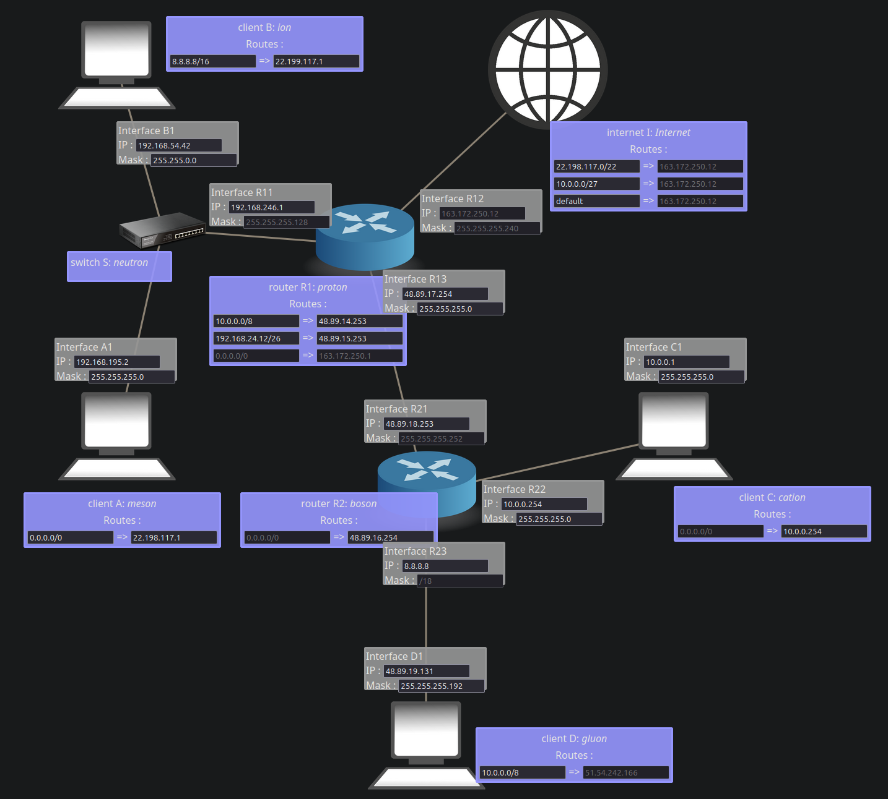

# NetPractice

NetPractice is a school project focused on the fundamentals of computer networking. The goal is to repair a series of small, simulated networks by configuring IP addresses, subnet masks, gateways, and routes until every required machine can communicate.

This repository contains my completed work for the project.



## Project Summary

- **Topic:** Intro to networking and the IP protocol
- **Type:** Solo school project
- **Time spent:** 2 weeks, October 2023 to November 2023
- **Final grade:** 100/100
- **Bonus:** Not available

The project comes from 42, a project-based programming school where students learn by completing practical assignments and defending their work in peer evaluations. For this project, the assignment was not to write a large program, but to demonstrate a working understanding of TCP/IP networking by solving increasingly complex network diagrams.

## What The Project Teaches

NetPractice is a practical introduction to how devices find each other on a network. Each level presents a broken network diagram in a browser interface. Some fields are locked, while others can be edited. The student must determine the correct values so that the required communication paths work.

The main concepts covered are:

- IPv4 addressing
- Subnet masks and CIDR notation
- Network and broadcast addresses
- Host ranges inside a subnet
- Default gateways
- Static routing tables
- Routers, switches, clients, and internet-like endpoints
- Packet path debugging through simulator logs

Instead of memorizing definitions, the project requires applying these concepts under constraints. A configuration may look reasonable but still fail because two interfaces are on incompatible subnets, a gateway is unreachable, a route is too broad or too narrow, or an address accidentally uses the network or broadcast address.

## Why This Is Challenging

The hard part of NetPractice is that every level is a small logic puzzle. One incorrect mask can change the entire meaning of an address range, and one incorrect route can send packets to the wrong place or create a loop.

The later levels are especially challenging because they combine several ideas at once:

- Splitting a single address range into multiple valid subnets
- Choosing usable host addresses while avoiding reserved addresses
- Making sure both directions of communication are possible
- Understanding when a route should target a specific subnet versus `default`
- Reading simulator logs to identify where packet forwarding fails
- Solving levels quickly enough for the timed evaluation format

During evaluation, students must solve three random levels from levels 6 to 10 within a limited time. That makes the project less about finding one answer online and more about being able to perform subnet calculations and routing reasoning reliably.

## Repository Contents

```text
.
|-- en.subject.pdf                       # Original project subject
|-- start.sh                             # Convenience script to open the simulator
|-- README.md                            # Original notes and useful links
|-- levels_progres.md                    # Practice timing notes
|-- net_practice/                        # Browser-based NetPractice simulator
|   |-- index.html
|   |-- level1.html ... level10.html
|   |-- js/
|   |-- css/
|   `-- img/
|-- saved_configs/                       # Exported solutions for each level
|-- config_but_non_terrible_format/      # Reformatted configs for readability
`-- screen_shots/                        # Screenshots captured during practice
```

The important deliverables are the saved configuration files. They represent the completed settings exported from the simulator after each level was solved.

## How To Run It

Open the simulator in a browser:

```bash
./start.sh
```

The script opens:

```text
net_practice/index.html
```

You can also open `net_practice/index.html` manually in a browser. The simulator is static HTML, CSS, and JavaScript, so it does not require a backend server.

## How The Workflow Works

1. Start the NetPractice interface.
2. Open a level.
3. Read the required connectivity goals.
4. Edit the available IP, mask, gateway, and route fields.
5. Click **Check again** to test the configuration.
6. Use the log output to find where packets fail.
7. Once the level passes, export the configuration.
8. Repeat for all 10 levels.

## Result

I completed all required levels and received a final score of **100/100**. The project strengthened my ability to reason about low-level networking without relying on automated subnet tools, which is important because the evaluation requires solving similar problems manually and under time pressure.
